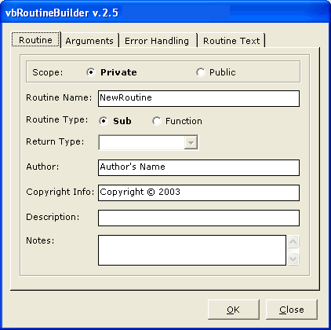



## \_\_RoutineBuilder v2\.5

### Description

vbRoutineBuilder 2.5

First off this code started with Kurt J. Tischer's first

http://www.planet-source-code.com/vb/scripts/ShowCode.asp?txtCodeId=40345&lngWId=1

Routine Builder project and has since taken off from there.

Hopefully, this will save you a lot of repetitive typing and make your code more uniform and readible. This is actually an improvement on the first authors code that I thought was a great VB Addin. The previous submission by Kurt J. Tischer fail short in its attempt to fully automate the writing of functions for each Routine.

Enjoy.
 
### More Info
 
This is a VB6 Subroutine and Function Builder Add-In. It's pretty robust and offers data/return type selection (will automatically select data/return types if you used standard prefixes for your arguments e.g. i; integer; obj; object, sng/sgl; single, etc.), optional argument + default value, error handling (On Error Resume Next, Goto Handler, Goto RoutineNameErr, Display or Raise + write to log file. The interface is locked down tight, too. As far as I can tell, no control is enabled or disabled before/after its time. Try it! I've updated this thing to include the actual routine text.

It will automagically check for available code panes when trying to use the Routine Builder in the Form editor or when there are no code panes open.

It also checks all VBProjects and all VBComponents for routines, variables, constants, events, and properties of the same name. If one is found, is displays message to user which Project, Component, Member was found, plus Scope and Type of Member.

I myself fixed a couple of errant bugs:

1. The "Ok" button isn't set as default so us poor keyboard orientated folks need to take our hand off the keyboard to click "Ok"

2. The Text1.Text field in the last tab is set to "Text1" so when the routine is dumped to the code pane it has "Text1" in the middle.

3. If you specify the "Routine Type" as "Function" but don't specify the "Return Type" the function declaration has an "As" statement tacked on the end with nothing behind it. This causes a syntax error within the VB IDE.

Those and a few others that were useful to me.

             |
---                |---
**Submitted On**   |2003-06-20 00:45:30
**By**             |[Crss B0NES](https://github.com/Planet-Source-Code/PSCIndex/blob/master/ByAuthor/crss-b0nes.md)
**Level**          |Intermediate
**User Rating**    |4.8 (19 globes from 4 users)
**Compatibility**  |VB 6\.0
**Category**       |[VB function enhancement](https://github.com/Planet-Source-Code/PSCIndex/blob/master/ByCategory/vb-function-enhancement__1-25.md)
**World**          |[Visual Basic](https://github.com/Planet-Source-Code/PSCIndex/blob/master/ByWorld/visual-basic.md)
**Archive File**   |[\_\_vbRoutin1603456202003\.zip](https://github.com/Planet-Source-Code/crss-b0nes-routinebuilder-v2-5__1-46314/archive/master.zip)

